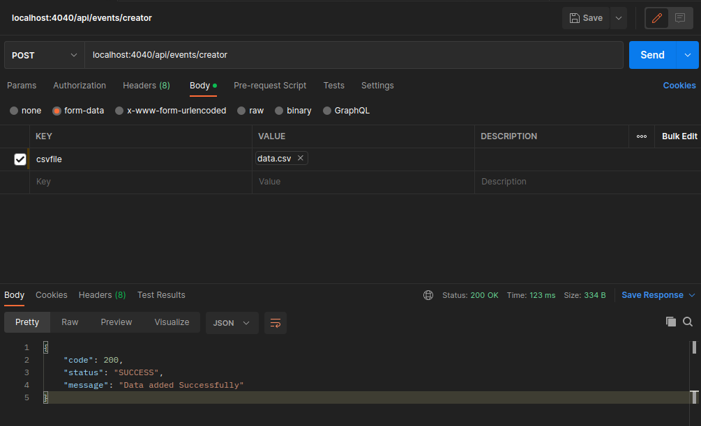

# GyanGrove API Documentation

## Table of Contents
- [Event Creator](#event-creator)
  - [Create Events in Bulk](#create-events-in-bulk)
  - [Create a Single Event](#create-a-single-event)
- [Event Finder](#event-finder)
  - [Find Events](#find-events)

## Event Creator

### Create Events in Bulk

- **Endpoint**: `/api/events/creator`
- **Method**: POST
- **Description**: Endpoint to create events in bulk by ingesting data from a CSV dataset.
- **Request Body**: A CSV file containing event data with name as csvfile.
- **Response**: Status code indicating success or failure.

### Create a Single Event

- **Endpoint**: `/api/events/creator/single`
- **Method**: POST
- **Description**: Endpoint to create a single event.
- **Request Body**: JSON object containing details of the event (e.g., event name, city, date, time, latitude, longitude).
- **Response**: Status code indicating success or failure.

## Event Finder

### Find Events

- **Endpoint**: `/api/events/find`
- **Method**: POST
- **Description**: Endpoint to find events based on a user's geographical location and a specified date. Returns events occurring within the next 14 days from the specified date.
- **Request Parameters**:
  - `latitude`: Latitude of the user's location.
  - `longitude`: Longitude of the user's location.
  - `date`: Date for which events are to be found.
- **Response**: JSON object containing a paginated list of events sorted by the earliest event after the specified date. Each event includes event name, city, date, weather, and distance from the user's location.

## Status codes

| Status Code | Reason                  |
|-------------|-------------------------|
| 200         | OK - Request successful |
| 400         | Bad Request             |
| 401         | Unauthorized            |
| 403         | Forbidden               |
| 404         | Not Found               |
| 500         | Internal Server Error   |
| 503         | Service Unavailable     |
